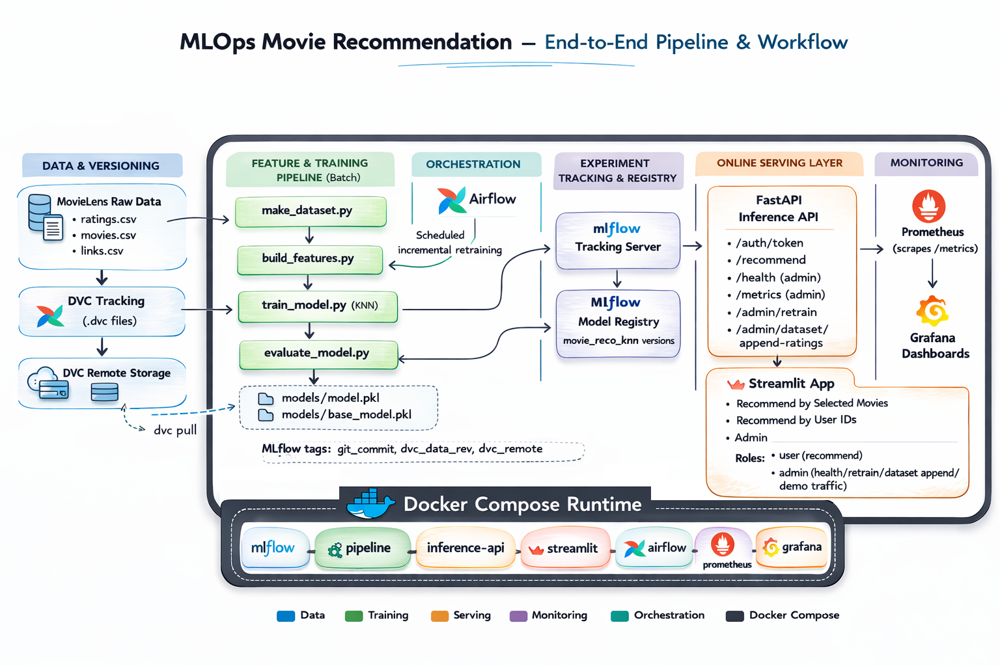

# MLOps Movie Recommendation

End-to-end movie recommendation workflow with:

- Feature engineering from MovieLens data
- KNN training and evaluation with MLflow tracking
- FastAPI inference service
- Streamlit UI (poster-based movie selection)
- Airflow incremental retraining DAG
- Prometheus + Grafana monitoring
- Docker Compose orchestration

## Workflow Diagram



## Project Structure

- `src/data/`: dataset preparation scripts
- `src/features/`: feature generation (`movie_matrix.csv`, `user_matrix.csv`)
- `src/models/`: training, evaluation, prediction, inference API
- `src/visualization/`: Streamlit app
- `dags/`: Airflow DAG for incremental retraining
- `monitoring/`: Prometheus and Grafana provisioning
- `models/`: saved models (`model.pkl`, `base_model.pkl`)
- `data/`: raw and processed datasets
- `tests/`: pytest unit tests

## Local Python Setup

```powershell
python -m venv .env
.\.env\Scripts\activate
pip install -r requirements.txt
```

## Run Core Pipeline (without Docker)

```powershell
python .\src\data\make_dataset.py .\data\raw .\data\processed
python .\src\features\build_features.py
python .\src\models\train_model.py --output-model-path .\models\model.pkl
python .\src\models\evaluate_model.py --model-path .\models\model.pkl --base-model-path .\models\base_model.pkl
```

## Run Full Stack with Docker Compose

```powershell
docker compose up -d mlflow airflow inference-api streamlit prometheus grafana
```

Run the pipeline once to generate/update processed features and model files:

```powershell
docker compose --profile pipeline up pipeline
```

Services:

- MLflow: `http://127.0.0.1:5000`
- Airflow: `http://127.0.0.1:8080` (default: `admin/admin`)
- FastAPI: `http://127.0.0.1:8000`
- Streamlit: `http://127.0.0.1:8501`
- Prometheus: `http://127.0.0.1:9090`
- Grafana: `http://127.0.0.1:3000` (default: `admin/admin`)

## API Quick Test

PowerShell:

```powershell
$body = @{ user_ids = @(1); top_k = 5 } | ConvertTo-Json -Compress
Invoke-RestMethod -Uri "http://127.0.0.1:8000/recommend" -Method Post -ContentType "application/json" -Body $body
```

## Monitoring

- FastAPI exposes metrics at `GET /metrics`
- Prometheus scrape config: `monitoring/prometheus/prometheus.yml`
- Grafana datasource provisioning: `monitoring/grafana/provisioning/datasources/datasource.yml`

## Airflow Incremental Retraining

The DAG in `dags/daily_incremental_training_dag.py` supports incremental updates:

- Uses 50% of ratings as initial training data
- Splits remaining 50% into 5 bulks
- Appends one bulk per run and retrains/evaluates

For testing, schedule can run every 2 minutes; for production, switch to daily.

## Run Tests

```powershell
pytest -q
```
